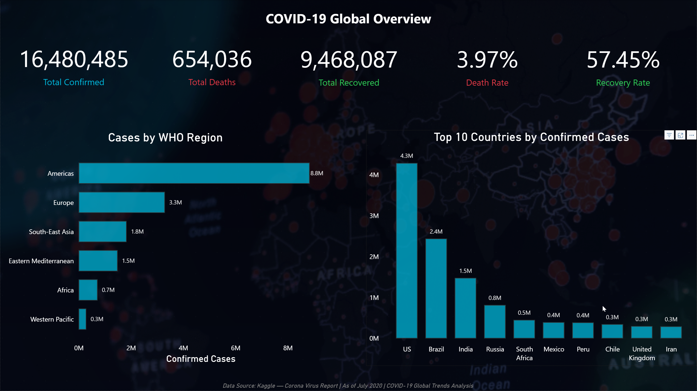
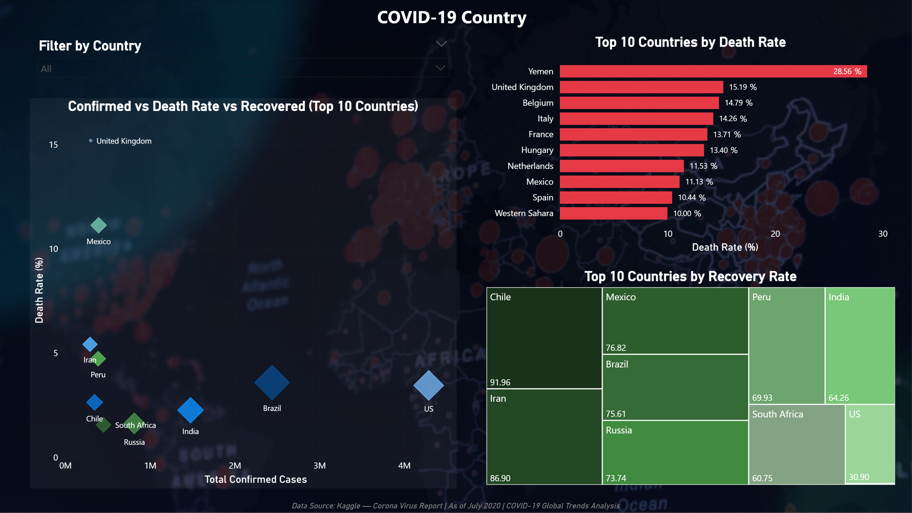
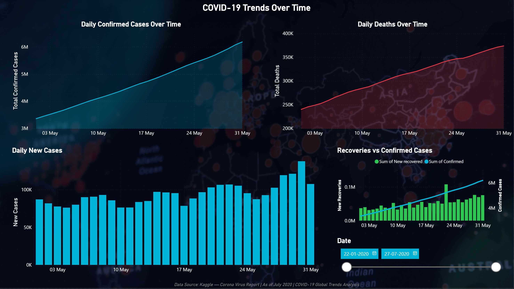

# 🌍 COVID-19 Global Trends Analysis


---

## 📌 Project Overview

This is an end-to-end data analytics project that analyses the global spread of COVID-19 using real-world data from Kaggle. The project covers the full data analytics workflow — from raw data ingestion and cleaning, through to SQL-based analysis and interactive Power BI dashboards.

The goal of this project is to uncover meaningful insights from COVID-19 data and present them in a clear, business-ready format that supports data-driven decision making.

This project was built as part of a personal portfolio to demonstrate practical skills in Python, SQL, data visualisation, and business intelligence reporting.

---

## 🎯 Project Objectives

* Analyse global COVID-19 trends across confirmed cases, deaths, and recoveries
* Identify the top 10 most affected countries by confirmed cases and death rate
* Understand how different WHO regions were impacted
* Track the progression of the pandemic over time using time-series analysis
* Explore the relationship between recovery rate and death rate across countries
* Build an interactive Power BI dashboard for stakeholder-ready reporting

---

## 📂 Dataset

* **Source:** [Kaggle - Corona Virus Report](https://www.kaggle.com/datasets/imdevskp/corona-virus-report)
* **Time Period:** January 2020 – July 2020
* **Files Used:**

| File | Description | Rows |
| --- | --- | --- |
| `country_wise_latest.csv` | Latest snapshot of cases per country | 187 |
| `covid_19_clean_complete.csv` | Daily cases by country over time | 49,068 |
| `day_wise.csv` | Global daily totals | 188 |
| `full_grouped.csv` | Country + date grouped data | 35,156 |
| `usa_county_wise.csv` | US county-level data | 627,920 |
| `worldometer_data.csv` | Rich country-level statistics | 209 |

---

## 🛠️ Tools & Technologies

| Tool | Purpose |
| --- | --- |
| Python (pandas, numpy) | Data loading, cleaning, and manipulation |
| Matplotlib & Seaborn | Data visualisation |
| PostgreSQL 17 + pgAdmin 4 | SQL-based data analysis |
| SQLAlchemy + psycopg2 | Python-to-PostgreSQL connection |
| Power BI Desktop | Interactive dashboard and reporting |
| GitHub | Version control and project hosting |
| VS Code | Development environment |

---

## 📁 Project Structure

```
covid19-global-analysis/
├── data/
│   ├── raw/                          # Original Kaggle CSV files (not pushed to GitHub)
│   └── processed/                    # Cleaned datasets ready for analysis
├── notebooks/
│   ├── 01_data_loading.ipynb         # Data loading, exploration, cleaning & visualisations
│   └── 02_sql_analysis.ipynb         # SQL analysis with PostgreSQL (9 queries)
├── sql/                              # SQL query scripts
├── powerbi/
│   └── covid19_dashboard.pbix        # Power BI dashboard file
├── screenshots/
│   ├── page1_global_overview.png
│   ├── page2_country_analysis.png
│   └── page3_trends_over_time.png
├── reports/                          # Summary reports and exports
└── README.md
```

---

## 🔍 Project Workflow

### Section 1 — Import Libraries

Imported all required Python libraries including pandas, numpy, matplotlib, and seaborn.

### Section 2 — Load Data

Loaded all 6 CSV files into Python using a dictionary-based approach with proper date parsing applied to time-series files.

### Section 3 — Data Exploration

Performed initial data exploration including:

* Head and tail preview of each dataset
* Data types and structure inspection using `info()`
* Statistical summary using `describe()` for both numerical and text columns
* Missing values check
* Duplicate entries check — **0 duplicates found** across all datasets

### Section 4 — Data Cleaning

Addressed all data quality issues found during exploration:

* Filled missing `Province/State` values with `"Unknown"`
* Filled missing `Admin2` (county names) with `"Unknown"`
* Dropped the `FIPS` column from `usa_county_wise` as it was not required for analysis
* Filled missing numerical columns in `worldometer_data` with `0`
* Filled missing text columns in `worldometer_data` with `"Unknown"`
* Saved all cleaned datasets to `data/processed/`

### Section 5 — Analysis & Visualisations

Conducted 6 key analyses with supporting visualisations:

#### 5.1 Global Overview

| Metric | Value |
| --- | --- |
| Total Confirmed Cases | 16,480,485 |
| Total Deaths | 654,036 |
| Total Recovered | 9,468,087 |
| Death Rate | 3.97% |
| Recovery Rate | 57.45% |

#### 5.2 Top 10 Countries by Confirmed Cases

The US accounted for approximately 26% of all global confirmed cases as of July 2020, with 4.3 million cases — more than Brazil and India combined.

#### 5.3 Top 10 Countries by Death Rate

Yemen had an exceptionally high death rate of 28.6%, nearly double that of the United Kingdom at 15.2%. European countries dominated the top 10, reflecting early and severe outbreaks before containment measures took effect.

#### 5.4 Global Trend Over Time

Global confirmed cases grew exponentially from March 2020, reaching 16.4 million by July 2020. Recoveries consistently lagged behind new confirmed cases throughout the period, indicating the pandemic was still accelerating at the dataset's end date.

#### 5.5 Recovery Rate vs Death Rate by Country

European countries showed high death rates with relatively low recovery rates, suggesting cases were still active. Countries in Africa and the Western Pacific achieved higher recovery rates with lower death rates.

#### 5.6 Cases by WHO Region

The Americas accounted for over 50% of global confirmed cases and deaths as of July 2020. Western Pacific regions maintained the lowest case counts, likely due to early containment measures.

---

### Section 6 — SQL Analysis with PostgreSQL

All 5 cleaned datasets were loaded into a local PostgreSQL database (`covid19_db`) using SQLAlchemy and psycopg2. A total of 9 SQL queries were written across three levels of complexity to validate and extend the Python analysis.

#### 6.1 Setup & Connection

Established a Python-to-PostgreSQL connection using SQLAlchemy with psycopg2, connecting to a locally hosted `covid19_db` database on port 5432.

#### 6.2 Data Loading

All 5 cleaned CSV files were loaded into PostgreSQL as tables using `df.to_sql()` with `if_exists='replace'`:

| Table | Source File | Rows |
| --- | --- | --- |
| `country_wise` | country_wise_latest_cleaned.csv | 187 |
| `covid_clean` | covid_19_clean_complete_cleaned.csv | 49,068 |
| `day_wise` | day_wise_cleaned.csv | 188 |
| `full_grouped` | full_grouped_cleaned.csv | 35,156 |
| `worldometer` | worldometer_data_cleaned.csv | 209 |

#### 6.3 Basic Queries

**Query 1 — Global Totals**
Aggregated the maximum confirmed cases, deaths, and recovered values from the `day_wise` table to produce a single row of global totals.

| total_confirmed | total_deaths | total_recovered |
| --- | --- | --- |
| 16,480,485 | 654,036 | 9,468,087 |

**Query 2 — Top 10 Countries by Confirmed Cases**
Ranked countries by confirmed cases descending. The US led with 4,290,259 cases — nearly double Brazil in second place (2,442,375).

**Query 3 — Top 10 Countries by Death Rate**
Sorted by `Deaths / 100 Cases`. Yemen ranked first with a death rate of 28.56%, followed by the United Kingdom (15.19%) and Belgium (14.79%).

#### 6.4 Intermediate Queries

**Query 4 — Total Cases by WHO Region**
Used `GROUP BY` and `SUM()` to aggregate confirmed cases, deaths, and recoveries by WHO region.

| WHO Region | Total Confirmed | Total Deaths | Total Recovered |
| --- | --- | --- | --- |
| Americas | 8,839,286 | 342,732 | 4,468,616 |
| Europe | 3,299,523 | 211,144 | 1,993,723 |
| South-East Asia | 1,835,297 | 41,349 | 1,156,933 |
| Eastern Mediterranean | 1,490,744 | 38,339 | 1,201,400 |
| Africa | 723,207 | 12,223 | 440,645 |
| Western Pacific | 292,428 | 8,249 | 206,770 |

**Query 5 — Countries with Recovery Rate Above 70%**
Filtered countries where `Recovered / 100 Cases > 70`, ordered by recovery rate descending. Holy See, Dominica, and Grenada all achieved 100% recovery rates, reflecting their very small case counts.

**Query 6 — Countries with Death Rate Above 10%**
Filtered countries where `Deaths / 100 Cases > 10`, ordered by death rate descending (top 20). Yemen (28.56%), United Kingdom (15.19%), and Belgium (14.79%) were the most severe.

#### 6.5 Advanced Queries

**Query 7 — Country Rankings using RANK() Window Function**
Applied the `RANK()` window function ordered by confirmed cases descending to assign a global rank to each country. The US ranked 1st with 4,290,259 cases, followed by Brazil (2nd) and India (3rd).

**Query 8 — Countries Above Average using CTE**
Used a Common Table Expression (CTE) to first calculate the global average confirmed cases, then filtered to only return countries exceeding that average. 24 countries were identified as above-average, led by the US, Brazil, and India.

**Query 9 — Rolling 7-Day Average of New Cases**
Applied a window function with `ROWS BETWEEN 6 PRECEDING AND CURRENT ROW` to calculate a smoothed 7-day rolling average of daily new cases, revealing the true underlying growth trend of the pandemic.

| Date | New Cases | Rolling 7-Day Avg |
| --- | --- | --- |
| 2020-01-22 | 0 | 0 |
| 2020-01-28 | 2,651 | 718 |
| 2020-02-01 | 2,111 | 1,515 |
| 2020-02-06 | 3,159 | 3,224 |
| 2020-02-10 | 2,538 | 3,249 |

---

### Section 7 — Power BI Dashboard

An interactive 3-page Power BI dashboard was built to present the analysis in a stakeholder-ready format. The dashboard uses a dark navy world map background, a consistent colour scheme (`#00B4D8` teal for confirmed cases, `#E63946` red for deaths, `#2DC653` green for recoveries), and fully transparent chart backgrounds throughout all pages.

> 🔗 **[View Live Interactive Dashboard](#)** ← *(link to be added after publishing to Power BI Service)*

> 📁 **Dashboard file:** `powerbi/covid19_dashboard.pbix` — open in Power BI Desktop

#### Page 1 — Global Overview

A high-level snapshot of the pandemic at a global scale.

* 5 KPI cards: Total Confirmed Cases, Total Deaths, Total Recovered, Death Rate, Recovery Rate
* Horizontal bar chart: Cases by WHO Region (`#00B4D8`)
* Column chart: Top 10 Countries by Confirmed Cases (`#00B4D8`)



---

#### Page 2 — Country Analysis

A deep-dive into country-level comparisons with interactive filtering.

* Dropdown slicer: Filter by Country
* Horizontal bar chart: Top 10 Countries by Death Rate (`#E63946`)
* Treemap: Top 10 Countries by Recovery Rate (green gradient)
* Scatter plot: Confirmed Cases vs Death Rate vs Recovered



---

#### Page 3 — Trends Over Time

Time-series analysis of how the pandemic evolved day by day, using the `day_wise_cleaned` dataset.

* Area chart: Daily Confirmed Cases Over Time (`#00B4D8`)
* Area chart: Daily Deaths Over Time (`#E63946`)
* Column chart: Daily New Cases (`#00B4D8`)
* Combo chart (Line + Column): Recoveries vs Confirmed Cases (`#2DC653` + `#00B4D8`)
* Date Range Slicer: Dynamically filter all charts by date range



---

## 📊 Key Insights

1. **The US was the global epicentre** — accounting for ~26% of all confirmed cases by July 2020
2. **Yemen's death rate of 28.6%** was an extreme outlier, nearly double the next highest country
3. **European countries dominated the death rate rankings** — UK, Belgium, Italy, and France all above 14%
4. **Global cases grew exponentially from March 2020** — the pandemic truly became global in that month
5. **The Americas bore the greatest burden** — highest confirmed cases, deaths, and recoveries across all WHO regions
6. **Recovery rate of 57.45% globally** — meaning ~40% of cases were still active at the dataset's end date
7. **24 countries exceeded the global average** for confirmed cases, highlighting how concentrated the pandemic was
8. **Rolling 7-day average** revealed sustained growth in new cases from late January through July 2020 with no sign of plateau

---

## ▶️ How to Run This Project

1. Clone the repository:

```bash
git clone https://github.com/jadliudit/covid19-global-analysis.git
cd covid19-global-analysis
```

2. Install required libraries:

```bash
python -m pip install pandas numpy matplotlib seaborn jupyter ipykernel squarify sqlalchemy psycopg2-binary
```

3. Download the dataset from [Kaggle](https://www.kaggle.com/datasets/imdevskp/corona-virus-report) and place all CSV files in `data/raw/`

4. Open and run the Python notebook:

```bash
jupyter notebook notebooks/01_data_loading.ipynb
```

5. Set up PostgreSQL locally (pgAdmin 4 recommended), create a database named `covid19_db`, then open and run:

```bash
jupyter notebook notebooks/02_sql_analysis.ipynb
```

6. To explore the Power BI dashboard, open `powerbi/covid19_dashboard.pbix` in Power BI Desktop.

---

## 📈 Status

| Section | Status |
| --- | --- |
| Data Loading & Exploration | ✅ Complete |
| Data Cleaning | ✅ Complete |
| Analysis & Visualisations | ✅ Complete |
| SQL Analysis (PostgreSQL) | ✅ Complete |
| Power BI Dashboard | ✅ Complete |

---

## 👤 Author

**Udit Jadli**

* 📧 [jadliudit@gmail.com](mailto:jadliudit@gmail.com)
* 💼 [LinkedIn](https://www.linkedin.com/in/jadliudit97/)
* 🐙 [GitHub](https://github.com/jadliudit)
* 🌐 [Portfolio](https://job-ready-55.emergent.host/)
